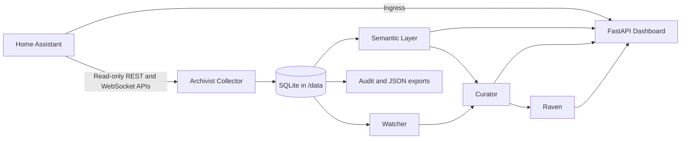

# Architecture

## System identity

The Nexus is a local-first Home Operating System.

Home Assistant is the execution platform, not the identity of the product. The Nexus observes the home through Home Assistant, builds durable understanding from that evidence, explains what it finds, recommends possible improvements, and may eventually assist with approved improvements.

The system remains useful without Codex, ChatGPT, or a cloud AI service. Home Assistant remains authoritative for runtime state and execution. The Nexus adds observation, organization, explanation, recommendation, and—only after explicit future approval—assistance around that platform.

## Architectural principles

The Nexus follows this authority sequence:

```text
Observe
   ↓
Recommend
   ↓
Approve
   ↓
Apply
```

No future intelligence module may bypass this workflow. Observation must be evidence-backed. Recommendations must be explainable. Production changes require explicit approval and a controlled application boundary.

The system is also:

- Local-first and independently operable.
- Read-only in the currently implemented modules.
- Rebuildable from Home Assistant state and accessible configuration data.
- Provenance-preserving, so derived knowledge can be traced to observations.
- Conservative about uncertainty: unavailable evidence remains unknown rather than becoming an invented fact.
- Modular: future capabilities consume documented contracts rather than reaching across module boundaries.

## Current module architecture

The approved module model separates implemented runtime capabilities from future architecture.

### Implemented

| Module | Responsibility | Current state |
|---|---|---|
| Archivist | Maintains historical truth through read-only snapshots and audit bundles. | Implemented in the Home Assistant app. |
| Watcher | Observes changes and persists evidence-backed health findings. | Implemented with manual and scheduled checks. |
| Semantic Layer | Transforms Home Assistant observations into stable semantic knowledge with provenance and confidence. | Implemented as a rebuildable local projection. |
| Dashboard / Nexus Experience | Presents current observations, health, history, reports, and navigation. | Implemented through the FastAPI Ingress application. |
| Curator | Organizes knowledge into areas, relationships, human concepts, and health context people can understand. | Implemented as a read-only projection over semantic and Watcher data. |
| Raven | Investigates selected controls and produces evidence-backed diagnoses and repair recommendations. | Implemented as a read-only diagnostic layer. |

### Planned

| Module | Responsibility | Boundary |
|---|---|---|
| Planner | Creates recommended plans and workflows. | Produces proposals, not production changes. |
| Engineer | Produces implementation plans and repair proposals. | Never silently modifies production. |
| Oracle | Predicts future states and identifies emerging issues. | Must explain uncertainty and evidence. |
| Tracy | Provides conversational intelligence, coordinates modules, and translates technical information into natural language. | Never bypasses the Observe → Recommend → Approve → Apply philosophy. |

The planned modules are architectural boundaries, not claims that those capabilities currently exist in the runtime.

## Module responsibilities

### Archivist

Archivist maintains historical truth. It collects read-only Home Assistant entity states and accessible registry data, stores snapshots and observations in SQLite, and produces downloadable audit bundles. Raw stored observations remain authoritative for rebuilds.

### Watcher

Watcher observes changes between snapshots. It identifies meaningful availability, state-health, entity, battery, and automation changes; persists stable findings; avoids duplicate unchanged noise; and records evidence, severity, confidence, lifecycle state, and resolution.

### Semantic Layer

The Semantic Layer transforms Home Assistant data into stable semantic knowledge for higher modules. It provides canonical facts for entities, devices, areas, capabilities, health, relationships, provenance, and confidence. It is rebuildable entirely from Home Assistant state and accessible collected data and must never become an independent source of truth.

### Dashboard / Nexus Experience

The Dashboard is the presentation surface for implemented modules. It provides the application shell, Overview, health, exploration, timeline, reports, and Ingress access. It is presentation-only and does not collect data, own semantic truth, or modify Home Assistant.

### Curator

Curator organizes knowledge into concepts humans understand. It provides area-centric organization, an Unassigned grouping, human concepts, conservative relationship exploration, and actionable read-only context for Watcher findings. Curator consumes semantic knowledge and evidence rather than creating a competing interpretation of raw Home Assistant data.

### Raven

Raven investigates anomalies, traces dependencies, explains failures, and produces evidence-backed diagnoses and repair recommendations. It can read UI-managed automation, script, and scene configurations through Home Assistant's read-only REST API when available, while preserving snapshot and configuration provenance. Raven never performs repairs and must distinguish observed evidence from inference.

### Planner — planned

Planner creates recommended plans and workflows from Curator, Watcher, Raven, and semantic evidence. Plans remain proposals until explicitly approved.

### Engineer — planned

Engineer produces implementation plans and repair proposals. Engineer may describe how an approved change could be made, but it never silently modifies production.

### Oracle — planned

Oracle predicts future states and identifies emerging issues. Predictions must expose uncertainty, assumptions, and supporting evidence.

### Tracy — planned

Tracy is the conversational intelligence of The Nexus. Tracy coordinates modules, understands intent, personalizes presentation, and translates technical information into natural language. Tracy does not directly execute production changes and never bypasses the Observe → Recommend → Approve → Apply workflow.

## Interface layer

Tracy is independent of presentation. The interface layer contains replaceable ways for users to interact with Tracy, including:

- Dashboard
- Touchscreen
- Voice
- Mobile
- Future interfaces

These interfaces are presentations of Tracy, not separate intelligences. The interface layer does not own orchestration, semantic truth, repair logic, or Home Assistant execution.

```text
Nexus modules → Tracy → Interface layer → user
                   ↓
       Recommend → Approve → Apply boundary
```

The Dashboard / Nexus Experience is the currently implemented interface surface. A future Concierge may be one presentation role in this layer; it is not a core system component or an independent source of intelligence.

## Canonical communication

The Nexus communicates first using the language of the home. People should be able to begin with rooms, activities, systems, and meaningful outcomes.

Engineering terminology remains available as supporting evidence. Entity IDs, domains, helpers, automations, scripts, scenes, and registry identifiers are useful for verification and implementation, but they are not the primary user interface whenever a meaningful human concept is available.

The system should prefer concepts such as Kitchen, Sleep, Security, Lighting, Climate, and Arrival over raw Home Assistant implementation details whenever practical, while preserving the underlying technical evidence for inspection.

## Runtime architecture



The Home Assistant app runs locally with FastAPI, Python 3.12, and SQLite. The collector uses the Supervisor-injected `SUPERVISOR_TOKEN` where appropriate and performs read-only collection. App-owned data and generated bundles remain under `/data`.

The current runtime path is:

1. Archivist collects entity states and accessible registry data.
2. SQLite stores the snapshot and observations.
3. The Semantic Layer rebuilds canonical facts from stored evidence.
4. Watcher compares snapshots and stores findings.
5. Curator organizes semantic and health evidence for human navigation.
6. The Dashboard / Nexus Experience presents the resulting views and exports.

Registry or API gaps degrade to incomplete or unknown evidence; they do not authorize guessed relationships. Curator relationship discovery is limited to explicit references available in collected data.

## Ownership and security boundaries

| Responsibility | Owner |
|---|---|
| Runtime execution and configuration | Home Assistant |
| Historical observations | Archivist and SQLite snapshots |
| Change findings | Watcher and SQLite findings |
| Stable semantic knowledge | Semantic Layer projection; raw observations remain authoritative |
| Human organization | Curator projection |
| Presentation | Dashboard / Nexus Experience and future interface roles |
| Conversation and orchestration | Tracy, when implemented |
| Production change application | A future explicitly approved boundary; not implemented |

The Nexus does not read `secrets.yaml`, authentication files, integration credentials, backups, `core.config_entries`, or arbitrary access-token stores. It does not modify Home Assistant configuration in the current architecture. All implemented modules are read-only.

## Non-goals

The Nexus is not:

- A replacement for Home Assistant.
- A cloud-dependent AI assistant.
- An autonomous controller.
- An independent source of truth for the home.
- A system that silently applies recommendations or repairs.

The Nexus remains evidence-backed, explainable, local-first, and user-approved.

## Historical context

Earlier project records described the initial Archivist app, the Semantic Knowledge Foundation, Watcher, and the first Nexus Dashboard as separate milestones. Those milestones remain part of the project history. This document consolidates them into the current architecture: Archivist maintains truth, Watcher observes change, the Semantic Layer stabilizes knowledge, Curator organizes meaning, the Dashboard presents it, and future modules operate through explicit recommendation and approval boundaries.
