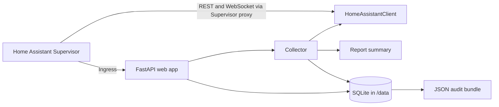

# Architecture

## Scope

The current implementation is The Archivist, a local Home Assistant app. The Nexus architecture describes future modules without claiming that they already exist.

## Current runtime architecture



The container starts `python -m archivist.main` through `rootfs/usr/local/bin/archivist`. FastAPI serves the Ingress page on port 8099. The collector performs read-only collection and writes snapshots and observations to SQLite.

Version 0.1.0 was verified on a live Home Assistant OS host. The production path installed and started the app, served Ingress, collected 436 entities, persisted the result in SQLite, and generated a validated JSON audit bundle. The verified baseline is tagged `v0.1.0`.

## Ownership boundaries

| Responsibility | Owner |
|---|---|
| Runtime automation state | Home Assistant |
| Home Assistant API access | `HomeAssistantClient` |
| Snapshot orchestration | `Collector` |
| Derived counts and report summary | `reports.summary` |
| Snapshot persistence | `storage.database` |
| Web presentation and manual action | FastAPI/templates/static assets |
| App-owned persistence | `/data` inside the app |
| Protected Home Assistant files | Never read by The Archivist |
| Home Assistant configuration changes | Not allowed in Version 0.1 |

Godot is not part of the current repository. If a future UI is added, it must remain presentation-only; the Python backend remains the source of truth.

## Data flow

1. A user opens the app through Home Assistant Ingress.
2. The user selects **Run Snapshot**.
3. The FastAPI endpoint asks the collector to run.
4. The collector reads entity states through the REST API.
5. The collector attempts entity, device, and area registry reads through the WebSocket API.
6. Registry failures degrade to empty collections rather than stopping the entire snapshot.
7. Summary counts are derived from returned state payloads.
8. SQLite stores the snapshot and entity observations.
9. The app exposes the snapshot as a downloadable JSON audit bundle.

## Module responsibilities

### Implemented: Archivist

Collects and stores read-only observations and produces an audit summary.

### Planned: Watcher

Future monitoring subsystem for detecting changes or recurring health conditions. No implementation exists yet.

### Planned: Curator

Future organization and normalization subsystem for making collected information easier to understand. No implementation exists yet.

### Future: Oracle

Future reasoning and recommendation subsystem. It must not silently change production.

### Future: Steward

Future controlled implementation subsystem for approved, reversible changes.

### Future: Laboratory

Future simulation and validation environment for testing proposed changes away from production.

## Local versus cloud responsibilities

Version 0.1 is local. Codex and ChatGPT are development collaborators, not runtime dependencies. No cloud AI service is required for the app to start, collect, store, or report data.

Future AI-assisted features may use external services only through explicit, documented boundaries and must not make local operation dependent on them.

## Security boundaries

- The app uses the Supervisor-injected `SUPERVISOR_TOKEN` only for permitted Home Assistant API calls.
- Collection is read-only.
- The app does not read `secrets.yaml`, authentication files, integration credentials, backups, `core.config_entries`, or arbitrary access-token stores.
- The app does not modify Home Assistant configuration in Version 0.1.
- App-owned data is kept under `/data`.
- Ingress provides the user-facing access path.

## Reliability goals

- A registry endpoint being unavailable must not discard state collection.
- SQLite writes must be atomic at the snapshot level.
- Generated reports must be traceable to a stored snapshot.
- Failures must produce structured logs and user-readable errors.
- Future changes should be reversible and testable independently.

## Future architecture direction

The intended future flow is:

```text
Archivist → Watcher → Curator → Oracle → approval gate → Steward → Laboratory/verification
```

This is a roadmap boundary, not an implemented runtime pipeline.
